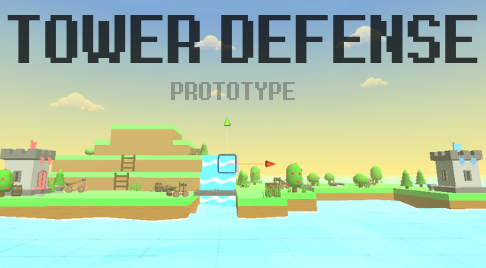

 

This prototype was made by following along with this Unity C# course: https://www.udemy.com/unitycourse2/ and further improved upon by myself afterward.

Try it out yourself with the WebGL Demo:

https://scaler.itch.io/tower-defense-prototype

HOW TO PLAY: 

Using a mouse, place a maximum of four towers around the level to stop the enemy helldogs from reaching your base.

Or check out a video of me playing it here:

https://youtu.be/5ZeRzVpaGeo

Upon completing this prototype, I've learned how to:

- Manipulate the editor through code to allow for snap-positioning of GameObjects
- Implement basic breadth-first path-finding using a variety of C# paradigms like coroutines, lists and queues
- Configure particles to act as projectiles and allow for damage to be done and received
- Add colliders and other components to GameObjects at run-time
- Use a "Factory" GameObject to act as a spawner that is ran by coroutines
- Implement basic AI that determines the closest target to the tower and fires on it
- Work with visual and audio effects and how to trigger them in code
- Create a basic UI that tracks the number of remaining enemies, how many the player has destroyed, and the player's base health. 

Changes I've made since completing the course:

- Implemented an array of queues to support multiple turrets.
- Created a second level with a new enemy and environment, along with the option to choose a second turret.
- Allowed for the material or mesh filter of a block to be changed upon placing a turret on it.
- Modified how enemies are spawned and move so that they are rotating correctly
- Created a persistent Game Manager to aid with setting level and enemy settings for the two levels.
- Added a simple UI system to choose which turret that is to be placed next.
